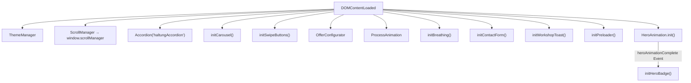

# alles.website — Projektkontextdatei

> **Zweck:** Kontextoptimiertes Referenzdokument für KI-Agenten, um kohärent und strukturtreu an diesem Projekt weiterzuarbeiten.
> **Stand:** 2026-04-28 · **Version:** 0.0.2

---

## 1. Projekt-Steckbrief

| Feld | Wert |
|---|---|
| **Projektname** | `janosch-kartschall-web` (package.json) |
| **Zweck** | Single-Page-Website für Janosch Kartschall — Systemischer Coach & Mediator in München |
| **Sprache** | Deutsch (`<html lang="de">`) |
| **Stack** | Vite 5 · SCSS (Dart Sass 1.70) · Vanilla ES6+ |
| **Deployment** | GitHub Pages via `gh-pages` (`npm run deploy`) |
| **Base-URL** | `/alles.website/` (vite.config.js) |
| **Domain** | janoschkartschall.de (OG-Meta) |
| **Externe Dienste** | Google Gemini API (Atem-Feedback), Google Maps Embed |
| **Fonts** | Inter (UI), Merriweather (Headlines), Font Awesome 6.4 (Icons) |

---

## 2. Dateistruktur

```
alles.website_v01/
├── index.html                 # Single-Page: ~960 Zeilen, alle Sections (0 Inline-Styles)
├── vite.config.js             # base: '/alles.website/'
├── package.json               # Scripts: dev, build, preview, deploy
├── .env                       # VITE_GEMINI_API_KEY
├── .gitignore                 # node_modules, dist, .env
│
├── src/
│   ├── main.js                # ⭐ Zentraler Entry-Point (Imports + DOMContentLoaded)
│   │
│   ├── js/
│   │   ├── theme.js           # ThemeManager (auto/light/dark, Video-Crossfade)
│   │   ├── scroll.js          # ScrollManager (Nav-Visibility, Touch-Tracking, Anchor-Smooth)
│   │   ├── hero.js            # HeroAnimation (Word-Split, Sequenced Reveal)
│   │   ├── breathing.js       # BreathExercise (Calibration → Guidance → Results, Immersive-Mode)
│   │   ├── breathing-utils.js # calculateBreathStats(), generateStaticFeedback()
│   │   ├── process.js         # ProcessAnimation (4-Step-Stepper mit Swipe + IntersectionObserver)
│   │   ├── pricing.js         # OfferConfigurator (3 Angebote, Slider, Toggle, animierte Preise)
│   │   ├── carousel.js        # Carousel (Infinite-Clone, Autoplay, Drag, Dots, responsive teardown)
│   │   ├── swipe.js           # SwipeButton (Dual-Action: Mail ← → Call)
│   │   ├── accordion.js       # Accordion (Single-Open, Focus-Mode)
│   │   ├── contact.js         # initContactForm + sendMail (mailto-Link-Builder)
│   │   ├── preloader.js       # initPreloader (Fade-out nach window.load)
│   │   ├── utils.js           # showToast() — Toast mit SVG-Logo (direkt importiert, kein Global)
│   │   │
│   │   ├── services/
│   │   │   └── gemini.js      # GeminiService (Gemini 2.5 Flash, Atem-Feedback)
│   │   │
│   │   └── modules/           # (leer — reserviert für zukünftige Module)
│   │
│   ├── scss/
│   │   ├── main.scss          # @use-Aggregation + body-Grundstyles
│   │   ├── _variables.scss    # CSS Custom Properties + Dark-Mode-Overrides + Z-Index-Scale + Mixins
│   │   │
│   │   ├── base/
│   │   │   ├── _reset.scss    # Box-Sizing-Reset, Scrollbar-Hide, Button/Link-Normalize
│   │   │   └── _typography.scss # Font-Stacks, Heading-Scale, Utility-Klassen (.text-orange, .ui-label)
│   │   │
│   │   ├── components/
│   │   │   ├── _badges.scss   # profile-process__badge, qualification/certification/rating badges
│   │   │   ├── _buttons.scss  # .btn, .btn--large, .btn--full
│   │   │   ├── _cards.scss    # feature-card, offer-card, review-card, workshop-card, contact-card
│   │   │   ├── _configurator.scss # .configurator__slider, .toggle-switch (+ --compact), .config-grid
│   │   │   ├── _forms.scss    # .input-field
│   │   │   ├── _profile.scss  # .profile-container (Neumorphic Kreis-Bilderrahmen)
│   │   │   └── _theme-switcher.scss # .theme-toggle-round (Logo-SVG-Button)
│   │   │
│   │   ├── layout/
│   │   │   ├── _hero.scss     # .hero, Video-Background, Brand, Animation-States
│   │   │   ├── _sections.scss # .section, .section-card, Section-Spacing, Utility-Klassen, Kontakt-Layout
│   │   │   └── _footer.scss   # .footer-links
│   │   │
│   │   └── modules/
│   │       ├── _accordion.scss   # .accordion, Focus-Mode, Slide-Animation
│   │       ├── _animations.scss  # Shared Keyframes (animate-bounce etc.)
│   │       ├── _breathing.scss   # Breath-Core-UI (Circle, Dots, Immersive-Mode)
│   │       ├── _carousel.scss    # .carousel, Viewport, Track, Dots, Disabled-State
│   │       ├── _nav.scss         # .bottom-nav, Nav-Items, Overlay, Show/Hide-Transitions
│   │       ├── _preloader.scss   # .preloader, Spinner, FadeOut
│   │       ├── _process.scss     # profile-process (Stepper, Icons, Progress-Line, Labels)
│   │       ├── _swipe.scss       # .swipe-container, Knob, Arrows, Step-Animations
│   │       └── _toast.scss       # #toast, Show/Hide-Animation
│   │
│   ├── img/                   # Profilbilder, Logos (JPG/PNG)
│   ├── assets/                # Videos (MP4), SVG-Logos, APK-Download
│   └── data/                  # (leer — reserviert)
│
└── dist/                      # Build-Output (gitignored)
```

---

## 3. Architektur-Prinzipien

### 3.1 Initialisierungsablauf



> **Reihenfolge in `main.js`:** Core → UI-Components → Feature-Modules → Visuals. Die HeroAnimation dispatcht ein Custom-Event `heroAnimationComplete`, das den Hero-Badge triggert.

### 3.2 Design-System: Neumorphismus

Das visuelle Fundament ist ein **Neumorphic Design** mit konsistentem Schatten-System:

| Token | Zweck |
|---|---|
| `--raised` | Erhabene Elemente (Buttons, Cards) |
| `--pressed-medium` | Eingedrückte Container (Inputs, große Felder) |
| `--pressed-small` | Kleine eingedrückte Elemente |
| `--engraved` | Gravierte Linien/Icons |
| `--text-raised` / `--text-pressed` | Text-/Icon-Schatten |

Jeder Token existiert in **Light- und Dark-Mode-Variante** (überschrieben in `body.dark-mode` innerhalb `:root`).

### 3.3 Theming (Tri-State)

```
auto → light → dark → auto (Zyklus)
```

- **Speicherung:** `localStorage('theme-pref-v1')` 
- **Video-Crossfade:** `ThemeManager` verwaltet zwei `<video>`-Elemente für nahtlosen Intro→Loop-Übergang und Theme-Wechsel
- **Meta Theme Color:** Dynamisch per Scroll-Position und Theme

### 3.4 Immersive Mode (Breathing)

Bei aktivem `BreathExercise` wird `body.mode-immersive` gesetzt:
- Alle Sections außer `#atmung` werden ausgeblendet (`opacity: 0`)
- Bottom-Nav wird versteckt
- ScrollManager respektiert diesen Zustand (`isImmersive`-Check)

### 3.5 Z-Index-Hierarchie

```
$z-base:      0      → Background, Videos
$z-content:   1      → Normaler Content
$z-elevated:  10     → Aktive Videos, Swipe
$z-sticky:    100    → Navigation
$z-overlay:   500    → Overlays, Dropdowns
$z-modal:     1000   → Modal-Dialoge
$z-toast:     1500   → Toast-Benachrichtigungen
$z-preloader: 9999   → Preloader
```

---

## 4. Seiten-Sections (index.html)

Die SPA besteht aus 5 Content-Sections innerhalb `<main>`:

| # | ID | Section | Hauptkomponenten |
|---|---|---|---|
| 1 | `#start` | **Hero** | Video-BG (Intro→Loop), Animated Title, Swipe-CTA, Theme-Toggle, Hero-Badge |
| 2 | `#haltung` | **Ansatz** | 6-Item Accordion, 3 Feature-Cards (Carousel auf Mobile) |
| 3 | `#ueber-mich` | **Über Mich** | Profilbild (Neumorphic), Fließtext, Qualifikations-Badges, Review-Carousel, 4-Step Process-Stepper |
| 4 | `#angebote` | **Angebote** | 3 Offer-Cards mit Konfigurator (Slider/Toggles), Swipe-Buttons, Workshop-Card |
| 5 | `#atmung` | **Atmung** | Breath Core (Calibration → Guidance → AI-Feedback), Share/Download-Buttons |
| 6 | `#kontakt` | **Kontakt** | Formular (Name + Thema → mailto), Social-Links, Google-Maps-Embed, Footer |

**Navigation:** Bottom-Nav (`<nav class="bottom-nav">`) mit 5 Items: Ansatz, Ich, Angebote, Atmung, Kontakt. Auto-Hide beim Scrollen, Show auf Scroll-Up.

---

## 5. Modul-Verantwortlichkeiten

### `ThemeManager` ([theme.js](file:///e:/antigravity_workspace/alles.website_v01/src/js/theme.js))
- Tri-State-Cycling: auto → light → dark
- Video-Management: Dual `<video>` mit Crossfade (`transitionToVideo()`)
- Intro-Video → Loop-Video Übergang (`onended`)
- Meta Theme Color dynamisch per Scroll & Theme
- Toast-Feedback bei Theme-Wechsel

### `ScrollManager` ([scroll.js](file:///e:/antigravity_workspace/alles.website_v01/src/js/scroll.js))
- Bottom-Nav Show/Hide basierend auf Scroll-Richtung + Touch-Tracking
- **Dynamischer Threshold:** Scroll-Down-Distanz beeinflusst benötigte Scroll-Up-Distanz
- Intro-Scroll-Lock bei `scrollY <= 50`
- Auto-Scroll-Detection für programmatische Scrolls
- Smooth-Scroll für alle `a[href^="#"]`
- Active-Section-Highlight in Nav

### `HeroAnimation` ([hero.js](file:///e:/antigravity_workspace/alles.website_v01/src/js/hero.js))
- Word-by-word Title-Animation (DOM-Split → `.hero-word` spans)
- Sequenced Reveal: Swipe-Button → Video-Shrink → Words → Text → Name → Tagline
- Custom Event `heroAnimationComplete` am Ende

### `BreathExercise` ([breathing.js](file:///e:/antigravity_workspace/alles.website_v01/src/js/breathing.js))
- **State-Machine:** `IDLE → CALIBRATION_READY → CALIBRATION_ACTIVE → GUIDANCE → FINISHED`
- Calibration: 3 manuelle Press/Release-Zyklen → avgIn/avgOut berechnen
- Guidance: 4 automatische Atemzyklen mit kalibriertem Timing
- Immersive-Mode (blendet restliche Seite aus)
- AI-Feedback via `GeminiService` (pre-loaded während Guidance)
- Dot-Progress-Indicator (7 Dots: 3 Calibration + 4 Guidance)

### `ProcessAnimation` ([process.js](file:///e:/antigravity_workspace/alles.website_v01/src/js/process.js))
- 4-Step Process-Stepper: Kennenlernen → Auftrag → Sitzung → Transfer
- Horizontales Track-Sliding (Centered Active Step)
- Progress-Line-Animation mit Rückwärts-Delay
- IntersectionObserver für `.in-view`-Class
- Touch-Swipe-Navigation

### `OfferConfigurator` ([pricing.js](file:///e:/antigravity_workspace/alles.website_v01/src/js/pricing.js))
- 3 Angebote mit hardcoded Daten:
  - **Fokus** (Session-basiert): 1-5 Sitzungen, 1-2 Personen, Mengenrabatt
  - **Deep Dive** (Session-basiert): 1-3 Sitzungen, 1-2 Personen
  - **Mediation** (Zeit-basiert): 60-120 Min, Rate/Min, Split auf 2 Parteien
- `animatePrice()`: requestAnimationFrame-Preisanimation mit Easing

### `Carousel` ([carousel.js](file:///e:/antigravity_workspace/alles.website_v01/src/js/carousel.js))
- Infinite-Scroll via Clone-Nodes (prepend + append)
- Autoplay (6s), pausiert bei Drag
- Touch/Mouse-Drag-Support
- Responsive: `data-mobile-only` → teardown auf Desktop (≥768px)
- Dot-Navigation

### `SwipeButton` ([swipe.js](file:///e:/antigravity_workspace/alles.website_v01/src/js/swipe.js))
- Dual-Action: Links = Mail (purple), Rechts = Call (blue)
- Knob-Drag mit visueller Feedback-Intensität (Opacity-Mapping)
- Threshold: 90% des Max-Drags zum Auslösen
- Mehrere Instanzen pro Seite (Hero + jede Offer-Card)

### `GeminiService` ([gemini.js](file:///e:/antigravity_workspace/alles.website_v01/src/js/services/gemini.js))
- Google Gemini 2.5 Flash API
- System-Prompt: Atem-Coach-Persona, max 250 Zeichen Feedback
- API-Key via `import.meta.env.VITE_GEMINI_API_KEY`
- Graceful Degradation bei fehlendem Key / Rate-Limit / 404

---

## 6. Design-Konventionen

### CSS-Klassen (BEM)
```
.block
.block__element
.block--modifier
```

**Beispiele:**
- `.hero__title`, `.hero__video-background--full`
- `.offer-card__badge--primary`, `.offer-card__footer`
- `.profile-process__step`, `.profile-process__line--progress`
- `.swipe-container--small`
- `.carousel__dot--active`

### Farb-Palette

| Rolle | Light | Dark |
|---|---|---|
| Background | `#ebebeb` | `#16181b` |
| Text Main | `#2b2f4e` | `#ebebeb` |
| Text Light | `#8d97a5` | `#b0b3b8` |
| Accent Orange | `#FF7E21` | `#FF7E21` |
| Accent Blue | `#00b3ff` | `#00b3ff` |
| Accent Purple | `#a855f7" | `#a855f7" |
| Shadow Light | `#ffffff` | `#1f252c` |
| Shadow Dark | `#d3d3d3` | `#0b0c0e` |

### Font-Scale (CSS Variables)

```
--font-size-xs:    0.65rem
--font-size-small: 0.80rem
--font-size-medium: 1rem
--font-size-large: 1.25rem
--font-size-xl:    1.5rem
--font-size-xxl:   1.75rem
```

### Typography-Zuordnung
- **Inter** (sans-serif) → Body-Text, UI-Labels
- **Merriweather** (serif) → Headings h1–h6

---

## 7. Kommunikationsmuster

### Custom Events
| Event | Dispatcher | Listener | Zweck |
|---|---|---|---|
| `heroAnimationComplete` | `HeroAnimation.play()` | `main.js → initHeroBadge()` | Badge nach Animation einblenden |

### Globale Referenzen
| Global | Typ | Zugriff |
|---|---|---|
| `window.scrollManager` | `ScrollManager` | `breathing.js` (Auto-Scroll-Flag) |

### State-Flags auf `<body>`
| Klasse | Gesetzt von | Ausgelesen von |
|---|---|---|
| `dark-mode` | `ThemeManager` | SCSS-Variablen, diverse Module |
| `mode-immersive` | `BreathExercise` | `ScrollManager` (Nav-Hide) |

---

## 8. Asset-Pipeline

### Videos (src/assets/)
| Datei | Zweck | Theme |
|---|---|---|
| `bg-start_intro_v09.mp4` | Hero Intro (einmalig) | Light |
| `bg-start_loop_v10.mp4` | Hero Loop (endlos) | Light |
| `bg-start-dark_loop_v08.mp4` | Hero Intro + Loop | Dark |

> **Hinweis:** Dark-Mode nutzt denselben Clip als Intro und Loop.

### Bilder (src/img/)
- `profile_picture_v01.jpg` — Profilbild (OG-Meta + Über Mich)
- `halle11-logo.jpg` — Akademie-Logo
- `ZFU-Siegel-Zugelassen-QMB-2023.png` — ZFU-Qualitätssiegel

### SVG-Logos (src/assets/)
- `logo.svg` — Favicon (Dark)
- `logo_light.svg" — Toast-Icon
- `logo_animated_draft.svg` — (Konzept)

---

## 9. Bekannte Eigenheiten & Technische Schulden

> [!WARNING]
> Vor Änderungen in diesen Bereichen besonders sorgfältig vorgehen.

1. ~~**Inline-Styles in HTML:**~~ ✅ Behoben (v0.0.2). Alle `style=""` durch BEM-Klassen ersetzt.
2. ~~**Inline-Event-Handler:**~~ ✅ Behoben (v0.0.2). `onclick` durch `<a>`-Tags mit `href` ersetzt.
3. **Hardcoded Pricing-Data:** `OfferConfigurator` enthält Angebotsdaten als JavaScript-Objekt statt externer Datenquelle. `src/data/` ist leer/reserviert.
4. **Video-Source-Mismatch:** `index.html` referenziert `bg-start_intro_v08.mp4`, aber `theme.js` importiert `bg-start_intro_v09.mp4` — das JS überschreibt die HTML-Source beim Init.
5. **Leere Verzeichnisse:** `src/js/modules/` und `src/data/` sind leer und für zukünftige Nutzung reserviert.
6. ~~**`showToast`-Exposure:**~~ ✅ Behoben (v0.0.2). `ThemeManager` importiert `showToast` direkt aus `utils.js`.
7. **ScrollManager-Naming:** Klassen `.neu-btn` und `.neu-icon-btn` werden im Touch-Feedback referenziert, existieren aber nicht im aktuellen HTML/CSS.
8. **Copyright-Jahr:** `2025` in Footer – sollte aktualisiert werden.

---

## 10. Workflow-Regeln für KI-Agenten

> [!IMPORTANT]
> Diese Regeln sind bei jeder Änderung strikt einzuhalten.

### MUSS
- Neue SCSS-Dateien als `_partial.scss` in den richtigen Ordner und in `main.scss` via `@use` importieren
- JavaScript-Module als ES6-Klassen/Funktionen mit `export`, Initialisierung in `main.js`
- BEM-Klassennamen verwenden
- CSS Custom Properties aus `_variables.scss` für Farben, Fonts, Shadows nutzen
- Semantisches HTML5
- `const`/`let` statt `var`
- Neue interaktive Elemente brauchen eine eindeutige ID

### DARF NICHT
- Inline-Styles hinzufügen
- Inline-Event-Handler (`onclick` etc.) verwenden
- `<script>` Tags in HTML einfügen
- CSS-Variablen umbenennen ohne Dark-Mode-Gegenstück
- Z-Index-Werte außerhalb der definierten Scale verwenden
- SCSS-Nesting tiefer als 3 Ebenen

### Dateizuordnung für neue Features

| Feature-Typ | SCSS-Ordner | JS-Ordner |
|---|---|---|
| Wiederverwendbare UI-Elemente | `components/` | `src/js/` (eigene Datei) |
| Große Layout-Bereiche | `layout/` | `src/js/` (eigene Datei) |
| Spezifische Funktionalität | `modules/` | `src/js/` (eigene Datei) |
| API-Services | – | `src/js/services/` |
| Utilities | – | `src/js/utils.js` oder eigene Datei |

---

## 11. Entwicklungskommandos

```bash
npm run dev      # Vite Dev Server (mit --host)
npm run build    # Production Build → dist/
npm run preview  # Preview des Builds
npm run deploy   # Build + gh-pages Deploy
```
